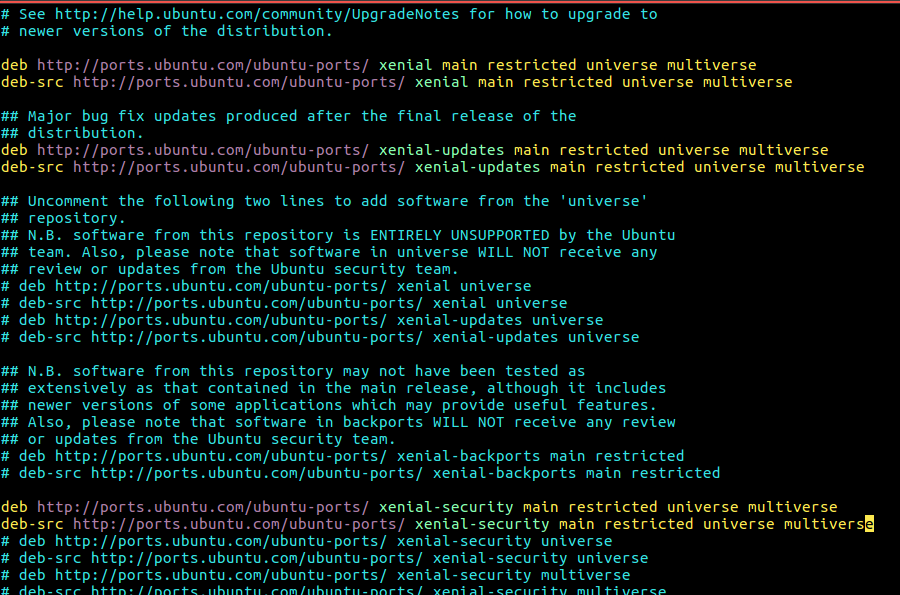
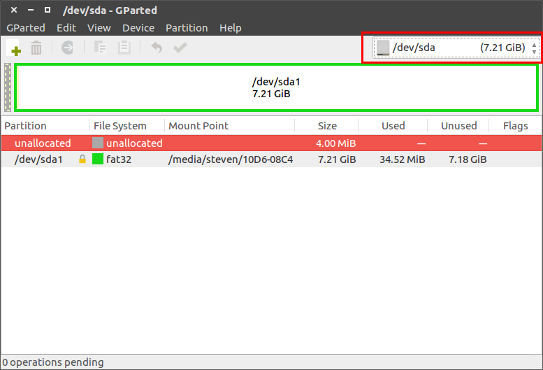
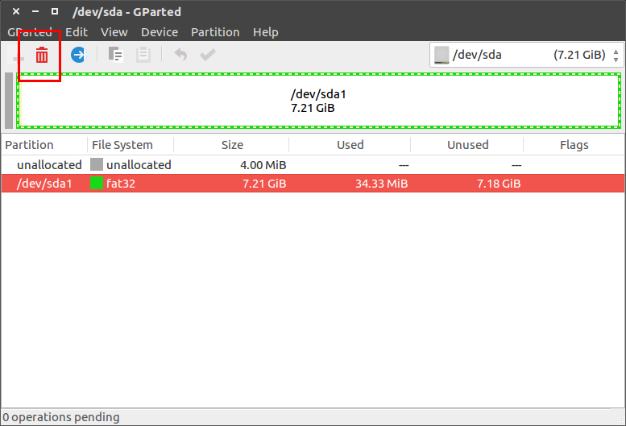
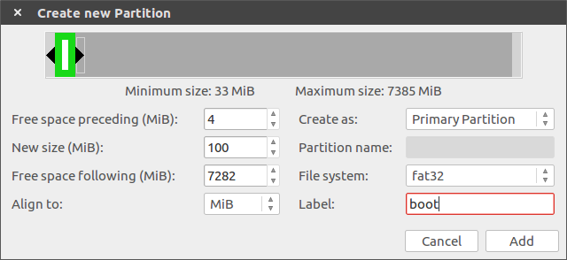
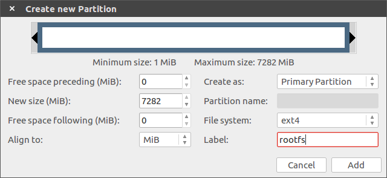
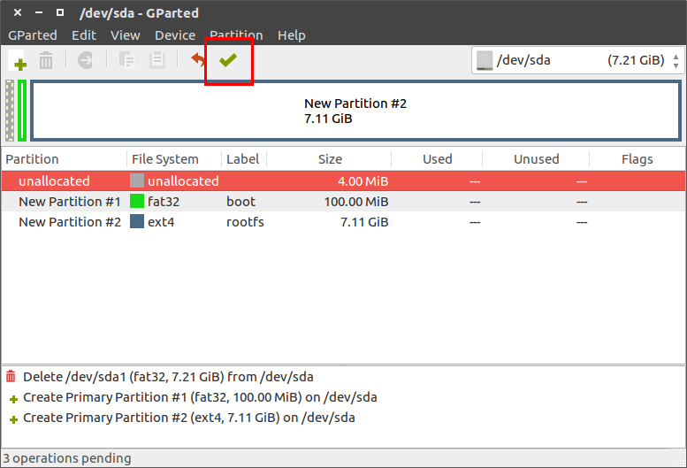
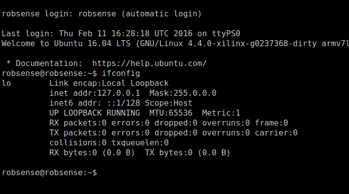
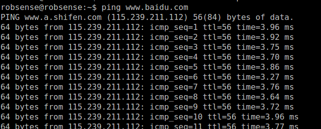
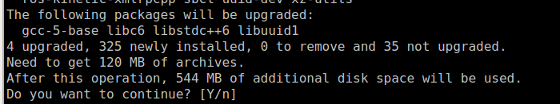
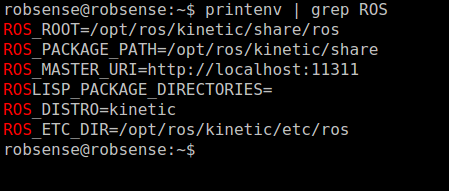

# Ubuntu Core And ROS On Devkit

Host PC OS: Ubuntu 16.04

## 1. Install Ubuntu Core 16.04

### 1.1 Download Filesystem

Create rootfs directory

```
mkdir rootfs
```

Download filesystem

```
http://cdimage.ubuntu.com/ubuntu-base/releases/16.04/release/ubuntu-base-16.04-core-armhf.tar.gz
```

Extract:

```
sudo tar -xpf ubuntu-base-16.04-core-armhf.tar.gz -C rootfs
```

### 1.2 Configure Rootfs

Install qemu-user-static on host PC:

```
sudo apt-get install qemu-user-static
```

**Note:**The  qemu-user-static emulator can run binaries for other architectures but with the same operating system as the current one.

Install qemu-user-static to rootfs

```
sudo cp /usr/bin/qemu-arm-static rootfs/usr/bin/
```

Create script **ch-mount.sh**:

```
#!/bin/bash

function mnt() {
    echo "MOUNTING"
    sudo mount -t proc /proc ${2}proc
    sudo mount -t sysfs /sys ${2}sys
    sudo mount -o bind /dev ${2}dev
    sudo mount -o bind /dev/pts ${2}dev/pts		
    sudo chroot ${2}
}

function umnt() {
    echo "UNMOUNTING"
    sudo umount ${2}proc
    sudo umount ${2}sys
    sudo umount ${2}dev/pts
    sudo umount ${2}dev

}

if [ "$1" == "-m" ] && [ -n "$2" ] ;
then
    mnt $1 $2
elif [ "$1" == "-u" ] && [ -n "$2" ];
then
    umnt $1 $2
else
    echo ""
    echo "Either 1'st, 2'nd or both parameters were missing"
    echo ""
    echo "1'st parameter can be one of these: -m(mount) OR -u(umount)"
    echo "2'nd parameter is the full path of rootfs directory(with trailing '/')"
    echo ""
    echo "For example: ch-mount -m /media/sdcard/"
    echo ""
    echo 1st parameter : ${1}
    echo 2nd parameter : ${2}
fi
```

Mount proc, sys, dev, dev/pts to new rootfs and enter chroot environment with **ch-mount.sh**

```
sudo bash ch-mount.sh -m rootfs/
```


**Note:** steps below are all done in chroot environment

Configure DNS:

```
echo "nameserver 8.8.8.8" | tee /etc/resolv.conf > /dev/null
```

Update the repositories:

```
apt-get update
```

Install minimal packages required:

```
apt-get install language-pack-en-base sudo ssh net-tools ethtool wireless-tools iputils-ping rsyslog bash-completion python-gobject-2 python-gtk2 lsb-release vim ifupdown
```

Enable universe and multiverse sourse(ROS need this):

```
vim /etc/apt/sources.list
```

Add ** universe multiverse** at the end of each line:



Update again:

```
apt-get update
```

Add user, password is robsense:

```
adduser robsense && addgroup robsense adm && addgroup robsense sudo && addgroup robsense audio
```

Add hostname

```
echo ‘robsense’ > /etc/hostname
```

Add host

```
echo -e ‘127.0.0.1    localhost\n127.0.1.1    robsense’ > /etc/hosts
```

Close system log

```
sudo systemctl disable rsyslog
```

### 1.3 Configure Auto Login Ubuntu

Enable getty on serial console:

```
systemctl enable getty@ttyPS1.service
```

Create the folder:

```
mkdir /etc/systemd/system/getty@ttyPS1.service.d
```

Create the file:

```
vim /etc/systemd/system/getty@ttyPS1.service.d/override.conf
```

Add this:

```
[Service]
ExecStart=
ExecStart=-/sbin/agetty --noissue --autologin robsense %I $TERM
Type=idle
```

### 1.4 Pack Rootfs

Type **exit** to quit chroot environment, and umont proc, sys, dev, dev/pts:

```
sudo bash ch-mount.sh -u rootfs/
```

Compression rootfs:

```
cd rootfs
sudo tar jcpf ubuntu-core-16.04-robsense.tar.bz2 .
or sudo tar jcpf ubuntu-core-16.04-robsense.tar.bz2 -C /media/steven/rootfs/ .
```

### 1.5 Partition SD Card

We use gparted to partiton sd card, which is easy to manage patition. Install it with apt:

```
sudo apt-get install gparted
```

Umount SD card:

```
umount /media/[PC username]/[sd label]
```

Open gparted, and select SD:



Select current fat32 parition, and delete it:



Create two new partiton:

First, fat32 partition, 200M, Primary Partition, Free space preceding is 4M, Label is "boot"



Second, ext4 partition,  Primary Partition, Free space preceding is 0, Label is "rootfs"



Finish with button below



### 1.6 Install Ubuntu To SD

Copy Boot.bin, uImage, devicetree.dtb to boot partition

**Note:** reference "Hellow World" section in "PhenixPro DevKit Developers' Guide"

Extract rootfs to SD card:

```
sudo tar -xpf ubuntu-core-16.04-robsense.tar.bz2 -C /media/[PC username]/rootfs
```

Umount SD card:

```
umount /media/[PC username]/*
```

### 1.7 Configure u-boot

u-boot will default to load ramdisk, we need to tell it to stop load ramdisk:

```
set sdboot 'if mmcinfo; then run uenvboot; echo Copying Linux from SD to RAM... && load mmc 0 ${kernel_load_address} ${kernel_image} && load mmc 0 ${devicetree_load_address} ${devicetree_image} && bootm ${kernel_load_address} - ${devicetree_load_address}; fi'
```

Tell it to load filesystem from sd card:

```
set bootargs 'console=ttyPS1,115200 maxcpus=1 root=/dev/mmcblk0p2 rw earlyprintk rootfstype=ext4 rootwait devtmpfs.mount=0'
```

if you want ubuntu to control two cpu:

```
set bootargs 'console=ttyPS1,115200 root=/dev/mmcblk0p2 rw earlyprintk rootfstype=ext4 rootwait devtmpfs.mount=0'
```

Boot system:




## 2. Install ROS Kinetic

### 2.1 Configure Network

```
sudo vim /etc/network/interfaces
```

Add:

```
auto eth0
iface eth0 inet static
address 192.168.0.234
gateway 192.168.0.1
netmask 255.255.255.0
dns-nameservers 114.114.114.114
```

Restart network:

```
sudo ifdown eth0 && sudo ifup eth0
```

Test:

```
ping www.baidu.com
```



### 2.2 Setup sources.list

```
sudo sh -c 'echo "deb http://packages.ros.org/ros/ubuntu $(lsb_release -sc) main" > /etc/apt/sources.list.d/ros-latest.list'
```

### 2.3 Setup keys

```
sudo apt-key adv --keyserver hkp://ha.pool.sks-keyservers.net:80 --recv-key 421C365BD9FF1F717815A3895523BAEEB01FA116
```

### 2.4 Installation 

Update Ubuntu repositories:

```
sudo apt-get update
```

Install Ros-Base:

```
sudo apt-get install ros-kinetic-ros-base
```



### 2.5 Initialize rosdep

```
sudo rosdep init
rosdep update
```

### 2.6 Environment setup

```
echo "source /opt/ros/kinetic/setup.bash" >> ~/.bashrc
source ~/.bashrc
```

### 2.7 Getting rosinstall

[rosinstall](http://wiki.ros.org/rosinstall) is a frequently used command-line tool in ROS that is distributed separately. It enables you to easily download many source trees for ROS packages with one command.

```
sudo apt-get install python-rosinstall
```

### 2.8 Check

```
printenv | grep ROS
```



## 3. Wakeup CPU1

Pilot code is running on cpu1(reference "Hellow World" section in "PhenixPro DevKit Developers' Guide")


