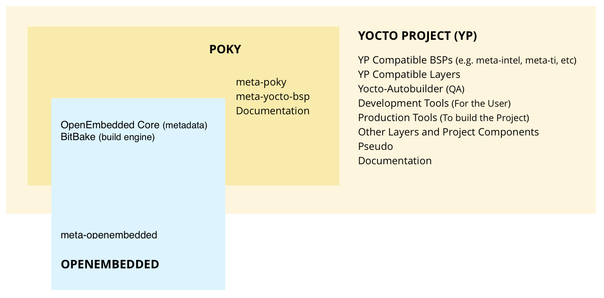

# Yocto

## 1. 安装

安装依赖软件包：

```
sudo apt-get install gawk wget git-core diffstat unzip texinfo gcc-multilib \
     build-essential chrpath socat cpio python python3 python3-pip python3-pexpect \
     xz-utils debianutils iputils-ping libsdl1.2-dev xterm
```

获取yocto工程：

```
git clone git://git.yoctoproject.org/poky
git checkout tags/yocto-2.4 -b poky_2.4
```


## 2. 编译仿真镜像

```
cd ~/poky
git checkout -b rocko origin/rocko
```

初始化编译环境

```
source oe-init-build-env
```

执行完上一条以后会进入到build目录，然后执行编译：

```
bitbake core-image-sato
```


## 3. 架构



Yocto项目结合，维护和验证三（3）个关键开发元素：

- 一套用于使嵌入式Linux成功工作的集成工具，包括用于自动化构建和测试的工具，用于板级支持和许可证合规性的工艺以及用于定制基于Linux的嵌入式操作系统的组件信息
- 一个参考嵌入式发行版（称为Poky）
- OpenEmbedded构建系统与OpenEmbedded Project共同维护

Yocto中有许多开源组件和工具，poky实际上是一个构建示例，它会使用包含的构建系统（构建引擎：BitBake，核心构建系统metadata：OpenEmbedded）来构建一个小型嵌入式操作系统。

### 3.1 专有名词

- **Configuration Files: **保存全局变量定义的文件，用户定义变量和硬件配置信息。他们告诉构建系统如何构建以及让image支持特定硬件平台
- **Recipe: **metadata的最常见形式。recipe将包含一张用于构建包的设置和任务（指令）的列表，这些包后续会被用于构建二进制image。一个recipe描述了库或者其他recipe的依赖关系，以及配置，编译选项。他们存储在layers中。他们用来描述如何获取，配置，编译和安装应用
- **Layer: **相关recipe的集合。layers允许你合并相关的metadata来自定义构建，并隔离多个架构构建的信息。layers在覆盖先前规范的能力上是分层的。您可以包含Yocto项目中的任意数量的可用图层，并通过添加图层来自定义构建。Yocto项目中的图层索引是可搜索的。比如树莓派的meta-raspberrypi就是一个layer
- **Metadata: **Yocto的一个关键元素就是metadata， 它用于构建linux的发行版，它包含在构建系统在构建映像时解析的文件中。一般而言，元数据包括recipe，配置文件和其他涉及构建指令本身的信息，也包括用于控制构建内容并影响其构建方式的数据。metadata还包括命令和数据，用于指示使用什么版本的软件，从哪里获得他们，以及用于修复bug或者在特定场景定制化的软件的改动和扩展。OpenEmbedded Core是一组重要的经过验证的metadata。
- **OpenEmbedded-Core: **oe-core是一个包括了的基本recipe，类和相关文件的metadate，这些文件在许多不同的OpenEmbedded衍生系统中都很常见，包括Yocto项目。它是由OpenEmbedded社区开发的原始资源库的一个精心设计的子集，该资源库已经被细化为一个更小的，核心的持续验证配方集，从而产生严格控制和质量保证的核心配方集。
- **Poky: **一个参考嵌入式发行版和一个参考测试配置为1）提供了一个基本级别的功能发行版，可用于说明如何定制发行版，2）测试Yocto Project组件，Poky用于验证Yocto项目，以及3 ）作为用户下载Yocto项目的载体。 Poky不是产品级的发行版，而是定制的一个很好的起点。 Poky是一个位于oe-core之上的集成层。
- **Build System - "Bitbake": **调度程序和执行引擎，用于分析指令（配方）和配置数据。 然后它创建一个依赖关系树来排序编译，调度包含的代码的编译，最后执行构建指定的自定义Linux映像（分发）。 BitBake是一个类似制作工具。 BitBake recipe指定如何构建特定的package。 它们包括所有程序包依赖项，源代码位置，配置，编译，构建，安装和删除说明。 recipe还将标准变量中的包的metadata存储起来。 相关的recipe被合并到一个layer中。 在构建过程中跟踪依赖关系，并执行包的本地或交叉编译。 作为跨构建设置的第一步，框架将尝试创建适用于目标平台的交叉编译器工具链（Extensible SDK）。
- **Packages: **构建系统的输出，用来创建最终的image
- **Extensible Software Development Kit (ESDK): **针对应用程序开发人员的定制SDK，允许他们将其库和编程更改合并到image中，以使其代码可供其他应用程序开发人员使用。


### 3.2 Workflow


- 开始时，开发人员指定架构，策略，补丁和配置细节。
- 构建系统从指定的地方获取和下载源码，该项目支持标准方法，如tarball或源代码仓库系统，如git。
- 一旦下载完成，源代码将被提取到应用补丁的本地工作区中，并且将运行用于配置和编译软件的常用步骤。
- 然后将软件安装到临时暂存区域，在该区域中使用您选择的二进制包格式（deb，rpm或ipk）来打包软件。
- 在整个构建过程中运行不同的QA和健全性检查。
- 创建二进制文件之后，会生成一个二进制包，然后用它来创建最终的根文件映像。
- 生成文件系统映像


**PS: **

Yocto的任务可以被单独执行，如果依赖关系允许的话。比如，可以单独运行内核配置的task等。

并不是所有可用的包都是默认选中的。

有些包可能提供相同的功能，如openssh，dropbear


### 3.3 yocto目录结构

- bitbake/：bitbake命令会用到的所有脚本
- documentation/：yocto相关的所有文档，可以生成为pdf
- meta/：OpenEmbedded-Core的metadata
- meta-skeleton/：包含BSP和内核开发的配方（recipes）模板
- meta-poky/：保存Poky参考发行版的配置
- meta-yocto-bsp/：保存Yocto参考BSP的配置
- oe-init-build-env：设置OpenEmbedded环境的脚本，它会生成一个build目录，名字可以改
- scripts：包含所有用于配置环境、开发工具等脚本


### 3.4 build目录结构

- conf/：配置文件，image和layer的配置:  bblayers.conf  local.conf
- downloads/：编译过程中recipes使用的上游的源码打包文件
- sstate-cache/：Shared state cache，所有编译共用
- tmp/：所有编译系统产生的输出文件
- tmp/buildstats/：构建所有包的统计信息（CPU用量，用时等）
- tmp/deploy/：编译的所有最终输出文件
- tmp/deploy/images/：OpenEmbedded编译出来的完整image，用于烧写到目标硬件
- tmp/work/：一组特定的工作目录，由架构来区分。他们被用来解包，配置，编译packages。包含打完补丁的源码，生成的objects和log
- tmp/sysroots/：共享库和头文件用于编译目标应用程序，但也用于主机


### 3.5 高级配置

- OpenEmbedded用配置变量来存储信息
- 按照管理，配置变量都是大写，如CONF_VERSION
- 为了让配置更简单，在一定的条件下，可以在前置(prepend)，扩展(append)或者定义这些变量
- 所有变量可以在build/conf/local.conf中被覆盖或者修改

#### 3.5.1 append

扩展的关键字是_append，它可以在一个预先定义好的变量的**后面**增加值，如：

```
#在镜像中增加dropbear的安装
IMAGE_INSTALL_append = " dropbear"
```

#### 3.5.2 prepend

前置的关键字是_prepend，它可以在一个预先定义好的变量的**前面**增加值，如：

```
#将文件夹添加到文件所在的路径
FILESEXTRAPATHS_prepend := "${THISDIR}/${PN}:"
```

#### 3.5.3 remove

在变量后面增加关键字_remove可以删除原始变量里面所有相关的值，如：

```
#删除i2c-tool
IMAGE_INSTALL_remove = "i2c-tools"
```

#### 3.5.4 define

追加机器名称仅为给定机器定义配置变量。它试图匹配来自MACHINEOVERRIDES的值，MACHINEOVERRIDES包括MACHINE和SOC_FAMILY。（MACHINEOVERRIDES：一个冒号分隔的，只适用于当前机器的覆盖列表），参考官方文档：https://www.yoctoproject.org/docs/latest/mega-manual/mega-manual.html#var-MACHINEOVERRIDES。

```
#只有当machine是beaglebone的时候才用am335x-bone.dtb
KERNEL_DEVICETREE_beaglebone = "am335x-bone.dtb"
```

#### 3.5.5 合并

前几个操作是可以合并的，如：

```
IMAGE_INSTALL = "busybox mtd-utils"
IMAGE_INSTALL_append = " dropbear"
IMAGE_INSTALL_append_beaglebone = " i2c-tools"
```

最终结果：

```
#对于beaglebone
IMAGE_INSTALL = "busybox mtd-utils dropbear i2c-tools"

#对于其他板子
IMAGE_INSTALL = "busybox mtd-utils dropbear"
```

#### 3.5.6 顺序

最具体的变量优先：

```
IMAGE_INSTALL_beaglebone = "busybox mtd-utils i2c-tools"
IMAGE_INSTALL = "busybox mtd-utils"
```

最终结果

```
#对于beaglebone
IMAGE_INSTALL = "busybox mtd-utils i2c-tools"

#对于其他板子
IMAGE_INSTALL = "busybox mtd-utils"
```

#### 3.5.7 操作符

= 用到变量的时候再扩展值
:= 立刻扩展值
+= append (with space)
=+ prepend (with space)
.= append (without space)
=. prepend (without space)
?= 如果之前没有赋值，才赋值
??= 和上一个一样，优先级更低


**PS: **注意，不要在local.conf中用+=, =+, .= 和 =. ，因为可能会因为顺序问题导致bug： 如果+=先于?=，后者就会无效。最好的方式是用_append来无条件扩展


### 3.6 recipe编写

#### 3.6.1 概览


- recipe描述了如何处理一个应用程序
- 一个recipe就是一系列指令的集合，它们描述了如何给指定的应用程序检索，修补，编译，安装和生成二进制包
- recipe也定义了在构建或者运行时需要哪些依赖
- recipe由BitBake解析
- recipe文件的命名格式为`<application-name>_<version>.bb`，列如树莓派内核的recpie文件名为`linux-raspberrypi_4.14.bb`


####3.6.2 recipe内容

- recipe包含配置变量：名称，许可证，依赖关系，检索源代码的路径
- recipe还包含一些函数，称为tasks，它们可以被编译系统运行（fetch, configure, compile...）。tasks包含了一组需要执行的动作。统一有一个前缀`_do`
- 用bitbake -c \<task\> \<target\> 命令来执行tasks，如树莓派的内核配置`bitbake linux-raspberrypi -c menuconfig`


#### 3.6.3 通用变量

为了使recpie更容易编写，有些变量是自动可用的：

- PN：package name， 在配方文件名称中所指定，如`linux-raspberrypi_4.14.bb`，PN就是linux-raspberrypi
- PV：package version，在配方文件名称中所指定，PV就是4.14
- PR：package release，默认为r0

recipe名和版本通常和服务器端的相匹配


#### 3.6.4 recipe的组织

很多程序由多个recipe，用来支持不同的版本。这种情况下，通用的metadata被特定版本指定的recipe用头文件的方式包含，也就是`.inc`文件：

- `<application>.inc`: 包含版本无关的metadata
- `<application>_<version>.bb`: 需要include`<application>.inc`和版本相关的metadata

由此，我们可以把recipe拆分成3个部分：

- 头文件：what/who
- 源码：where
- tasks：how

##### 3.6.4.1 头文件

配置变量来描述应用程序：

- DESCRIPTION：描述软件信息
- HOMEPAGE：工程的主页的URL
- PRIORITY：默认为optional
- SECTION：package的类别，如 console，utils，kernel
- LICENSE：许可证

还有一些其他的公用的变量，tasks


##### 3.6.4.2 源码

我们需要从官方位置检索原始数据源以及配置，修补或安装应用程序所需的资源

- SRC_URI：定义了从哪里，并且如何检索需要的元素，它是一组指向资源位置（本地或远程）的URI方案。URI的语法：`scheme://url;param1;param2`。
- `scheme`可以描述一个本地文件：`file://`， 或者远程位置`https://, git://, svn://, hg://, ftp://...`。例如`SRC_URI = "git://github.com/raspberrypi/linux.git;branch=rpi-4.9.y"`
- 默认情况下，源码下载后会放在`$BUILDDIR/downloads`。在local.conf中可以用变量DL_DIR来改变存放路径


scheme详解：

- Git：`git://<url>;protocol=<protocol>;branch=<branch>`。用git的时候还需要定义一个变量SRCREV，用来指定版本，如：

  ```
  SRCREV = "e7976b2affa8c05bd299ead0ad9c36ddaf135b9d"
  SRC_URI = "git://github.com/raspberrypi/linux.git;branch=rpi-4.9.y"
  ```

- http, https和ftp：`https://example.com/application-1.0.tar.bz2`。有些变量可以帮助定位远程位置：`${SOURCEFORGE_MIRROR}，${GNU_MIRROR}，${KERNELORG_MIRROR}...`。举例：

  ```
  SRC_URI = ${SOURCEFORGE_MIRROR}/<project-name>/${PN}-${PV}.tar.gz
  ```

  除此之外，还需要提供md5**或者**sha256校验值：

  ```
  SRC_URI += "https://example.com/application-1.0.tar.bz2"
  SRC_URI[md5sum] = "..."
  SRC_URI[sha256sum] = "..."
  ```

  也可以用name参数来一次性校验多个文件：

  ```
  SRC_URI = "http://example.com/src.tar.bz2;name=tarball \
             http://example.com/fixes.patch;name=patch"
  SRC_URI[tarball.md5sum] = "97b2c3fb082241ab5c56..."
  SRC_URI[patch.md5sum] = "b184acf9eb39df794ffd..."
  ```

- 本地文件：所有SRC_URI指定的本地文件会拷贝到recipe的工作目录：`build/tmp/work`。搜索路径定义在`FILESPATH`中：

  ```
  FILESPATH = "${@base_set_filespath([
  "${FILE_DIRNAME}/${PN}",
  "${FILE_DIRNAME}/${PN}-${PV}",
  "${FILE_DIRNAME}/files"], d)}"
  FILESOVERRIDES = "${MACHINEOVERRIDES}:${DISTROOVERRIDES}"
  ```

  - base_set_filespath(path)用参数path、FILESEXTRAPATHS和FILESOVERRIDES来给`FILESPATH`赋值；
  - 用户自定义的路径和文件可以用FILESEXTRAPATHS和FILESOVERRIDE来添加

- 压缩包：在解压缩的时候，BitBake默认会在命名为`<application>-<version>`的目录下找压缩后的文件，目录的路径可以通过变量`S`来控制，如果目录有其他名字，必须定义此变量
  **注意：**如果软件源是git，`S`必须设置成`${WORKDIR}/git`，例如：

  ```
  SRC_URI = "git://github.com/sarfata/pi-blaster \
             file://remove-initscript-lsb-dependency.patch \"
  S = "${WORKDIR}/git"
  ```

- 许可证文件：

  - 许可证文件必须有自己的校验值，可以用md5sum命令得到(`rpi-build/tmp/work-shared/raspberrypi3/kernel-source/COPYING`用命令得到的校验码和`/meta-raspberrypi/recipes-kernel/linux/linux-raspberrypi.inc`中写的是一样的)

  - `LIC_FILES_CHKSUM`定义了许可证文件的路径和校验码，如：

    ```
    LIC_FILES_CHKSUM = "file://gpl.txt;md5=393a5ca..."
    LIC_FILES_CHKSUM = \
    "file://main.c;beginline=3;endline=21;md5=58e..."
    LIC_FILES_CHKSUM = \
    "file://${COMMON_LICENSE_DIR}/MIT;md5=083..."
    ```

    这样可以跟踪许可证的更新，如果许可证不一样了校验码也就不一样，编译就会失败

#### 3.6.5 依赖

一个recpie可能那个在构建或者运行是有依赖关系。为了反映这个需求，会用以下两个变量：

- DEPENDS：编译时的依赖列表
- RDEPENDS：运行时的依赖列表。必须指定package，如_${PN}

举例：

```
DEPENDS = "recipe-b"
#以下符号都可用 =, >, <, >= 和 <=
DEPENDS = "recipe-b (>= 1.2)"
RDEPENDS_${PN} = "recipe-b"
RDEPENDS_${PN} = "recipe-b (>= 1.2)"
```

查看依赖关系：

```
bitbake -g -u depexp rpi-basic-image
```


#### 3.6.6 tasks

默认以下的tasks已经存在：

▶ do_fetch
▶ do_unpack
▶ do_patch
▶ do_configure
▶ do_compile
▶ do_install
▶ do_package
▶ do_rootfs

可以用以下命令查询当前存在的tasks：

```
bitbake <recipe> -c listtasks
```


新写一个task：

- task的函数用的是shell脚本的语法，有以下变量是已经存在的：

  - D：目标目录（创建image前，文件安装的根目录）如：

    ```
    do_install() {
        oe_runmake STRIP='echo skipping strip' dist
        mkdir -p ${D}${datadir}/fonts/truetype/freefont/
        install ${S}/fonts/* ${D}${datadir}/fonts/truetype/freefont/
    }
    ```

  - WORKDIR：recipe的工作目录

- task语法：

  ```
  do_task() {
      action0
      action1
      ...
  }
  ```

  列：

  ```
  do_compile() {
      ${CC} ${CFLAGS} ${LDFLAGS} -o hello ${WORKDIR}/hello.c 
      #用makefile也行
      oe_runmake
  }
  do_install() {
      install -d ${D}${bindir}
      install -m 0755 hello ${D}${bindir}
  }
  ```


扩展现有task：

和变量一样，用_prepend和 _append可以对现有task进行扩展

```
do_install_append() {
    install -d ${D}${sysconfdir}
    install -m 0755 hello.conf ${D}${sysconfdir}
}
```


增加task：

用addtask可以增加一个新的task到bitbak

```
do_mkimage () {
    uboot-mkimage ...
}
addtask
mkimage after do_compile before do_install
```


#### 3.6.7 一个recipe的列子

```
DESCRIPTION = "Hello world program"
HOMEPAGE = "http://example.net/helloworld/"
PRIORITY = "optional"
SECTION = "examples"
LICENSE = "GPLv2"
SRC_URI = "file://hello.c"
LIC_FILES_CHKSUM = \
"file://hello.c;beginline=3;endline=21;md5=58e..."
do_compile() {
    ${CC} ${CFLAGS} ${LDFLAGS} -o hello ${WORKDIR}/hello.c
}
do_install() {
    install -d ${D}${bindir}
    install -m 0755 hello ${D}${bindir}
}
```


#### 3.6.8 带版本无关部分的recipe例子

tar.inc

```
SUMMARY = "GNU file archiving program"
HOMEPAGE = "http://www.gnu.org/software/tar/"
SECTION = "base"
SRC_URI = "${GNU_MIRROR}/tar/tar-${PV}.tar.bz2"
do_configure() { ... }
do_compile() { ... }
do_install()
{ ... }
```

tar_1.17.bb

```
require tar.inc
LICENSE = "GPLv2"
LIC_FILES_CHKSUM = \
"file://COPYING;md5=59530bdf33659b29e73d4adb9f9f6552"
SRC_URI += "file://avoid_heap_overflow.patch"
SRC_URI[md5sum] = "c6c4f1c075dbf0f75c29737faa58f290"
```

tar_1.26.bb

```
require tar.inc
LICENSE = "GPLv3"
LIC_FILES_CHKSUM = \
"file://COPYING;md5=d32239bcb673463ab874e80d47fae504"
SRC_URI[md5sum] = "2cee42a2ff4f1cd4f9298eeeb2264519"
```


#### 3.6.9 安装patch

打补丁用于修复一些现有软件的bug。.patch, .diff 结尾的文件，或者有 apply=yes 的参数，将会在源码解压以后在do_patch中被应用。用法和源码一样：

```
#来自meta-raspberrypi/recipes-kernel/linux/linux-raspberrypi-dev.bb
SRCREV = "${AUTOREV}"
SRC_URI = "git://github.com/raspberrypi/linux.git;protocol=git;branch=${LINUX_RPI_DEV_BRANCH} \
           file://0001-build-arm64-Add-rules-for-.dtbo-files-for-dts-overla.patch \
"
```

在meta-raspberrypi/recipes-kernel/linux/文件夹下面有一个和linux-raspberrypi-dev.bb同名的目录，里面就放了patch文件。

默认的patch工具是quilt，可以通过改变变量PATCHTOOL来改变补丁工具，可用的值为`git, patch and quilt`

变量PATCHRESOLVE用于patch的冲突处理：

- noop：如果patch出现冲突，让编译失败
- user：新开一个窗口手动解决冲突

meta-poky的默认情况是noop


## 4.树莓派镜像

###4.1 编译

下载编译环境：

```
git clone -b rocko git://git.yoctoproject.org/poky
git clone -b rocko git://git.openembedded.org/meta-openembedded
git clone -b rocko git://git.yoctoproject.org/meta-raspberrypi
```

进入poky目录，执行环境初始化脚本：

```
source oe-init-build-env rpi-build
```

执行完毕后就已经在rpi-build目录下，然后修改配置文件：

```
echo 'MACHINE = "raspberrypi3-64"' >> conf/local.conf
echo 'PREFERRED_VERSION_linux-raspberrypi = "4.%"' >> conf/local.conf
echo 'DISTRO_FEATURES_remove = "x11 wayland"' >> conf/local.conf
echo 'DISTRO_FEATURES_append = " systemd"' >> conf/local.conf
echo 'VIRTUAL-RUNTIME_init_manager = "systemd"' >> conf/local.conf
```

参考meta-raspberrypi中的README.md，里面说明了必要的依赖关系，根据依赖关系修改layer配置，bblayers.conf：

```
robin@robin-pc:~/Develop/yocto/poky/rpi-build$ vim conf/bblayers.conf 

# POKY_BBLAYERS_CONF_VERSION is increased each time build/conf/bblayers.conf
# changes incompatibly
POKY_BBLAYERS_CONF_VERSION = "2"

BBPATH = "${TOPDIR}"
BBFILES ?= ""

BBLAYERS ?= " \
  /home/robin/Develop/yocto/poky/meta \
  /home/robin/Develop/yocto/poky/meta-poky \
  /home/robin/Develop/yocto/meta-openembedded/meta-oe \
  /home/robin/Develop/yocto/meta-openembedded/meta-multimedia \
  /home/robin/Develop/yocto/meta-openembedded/meta-networking \
  /home/robin/Develop/yocto/meta-openembedded/meta-python \
  /home/robin/Develop/yocto/meta-raspberrypi \
  "
BBLAYERS_NON_REMOVABLE ?= " \
  /home/robin/Develop/yocto/poky/meta \
  /home/robin/Develop/yocto/poky/meta-poky \
  "
```

执行编译

```
#CUI,只有cmdline的ui，
bitbake rpi-basic-image
#GUI,X11
bitbake core-image-sato
#GUI,Wayland/Weston(桌面shell)
bitbake core-image-weston
```

完成以后，用dd命令或者etcher烧写镜像`rpi-build/tmp/deploy/images/raspberrypi3-64/rpi-basic-image-raspberrypi3-64.rpi-sdimg`到SD卡，用root可直接无密码登录


**PS: **下载的内核源码在`~/Develop/yocto/poky/rpi-build/tmp/work-shared/raspberrypi3/kernel-source/

如果出现如下错误：

```

```

重新构建gdb即可：

```
bitbake gdb -cclean ; bitbake gdb -C unpack
```


### 4.2 生成文档

meta-raspberrypi/docs下是官方提供的配置文档，可以生成html等格式，方便阅读，先安装依赖

```
pip install recommonmark sphinx
```

然后执行makefile

```
make html
```

然后浏览器打开`docs/_build/html/index.html`


### 4.3 常用配置

#### 4.3.1 启用uboot

默认情况下，树莓派的linux由GPU的引导代码直接引导启动，启用uboot后，GPU引导代码将会引导uboot启动，由uboot引导linux，配置local.conf：

```
RPI_USE_U_BOOT = "1"
```


### 4.4 配置内核

```
bitbake linux-raspberrypi -c kernel_configme -f
bitbake linux-raspberrypi -c menuconfig
```

其中，linux-raspberrypi是根据官方layer：meta-raspberrypi中的recipe（配方）里面的linux-raspberrypi_4.9.bb来的，目录为`meta-raspberrypi/recipes-kernel/linux`， 里面还有一个linux-raspberrypi-dev.bb的配置，如果要用这个配置指定的内核，需要：

```
bitbake linux-raspberrypi-dev -c kernel_configme -f
bitbake linux-raspberrypi-dev -c menuconfig
```


### 4.5 VC4 驱动

配置local.conf：

```
MACHINE_FEATURES_append = "vc4graphics"
```

配置config.txt：

```
dtoverlay=vc4-kms-v3d
gpu_mem=128
```

启动后lsmod可以看到VC4驱动已经加载:

```
root@raspberrypi3:~# lsmod | grep vc4
vc4                   139594  3
drm_kms_helper        162773  2 vc4
drm                   358994  4 vc4,panel_raspberrypi_touchscreen,drm_kms_helper
snd_soc_core          179966  1 vc4
snd_pcm                98443  3 vc4,snd_pcm_dmaengine,snd_soc_core
```

设备节点也存在:

```
root@raspberrypi3:~# ls /dev/dri/ 
by-path     card0       controlD64  renderD128
```


### 4.6 wifi配置

扫描SSID：

```
sudo iwlist wlan0 scan
```

可以在结果中看到公司的wifi：lmeng3，然后创建配置：

```
sudo vim /etc/wpa_supplicant.conf
```

添加：

```
ctrl_interface=/var/run/wpa_supplicant
network={
    ssid="lmeng3"
    psk="hellolmeng"
}
```

启用无线网卡

```
#由于/etc/network/interfaces中已经配置好用dhcp模式获取ip，所以直接启用网卡即可上网
ifup wlan0
```

**PS: **wpa_supplicant.conf中保存明文密码并不安全，可以使用`wpa_passphrase`工具生成加密的PSK密码：

```
pi@raspberrypi:~$ wpa_passphrase "lmeng3" "hellolmeng"
network={
        ssid="lmeng3"
        #psk="hellolmeng"
        psk=907d729f0226c9a3d101e5d9e71f0882a72096a13acc46d2a87ce4bac7291b3a
}
```

把hellolmeng这行，删掉，然后写入wpa_supplicant.conf