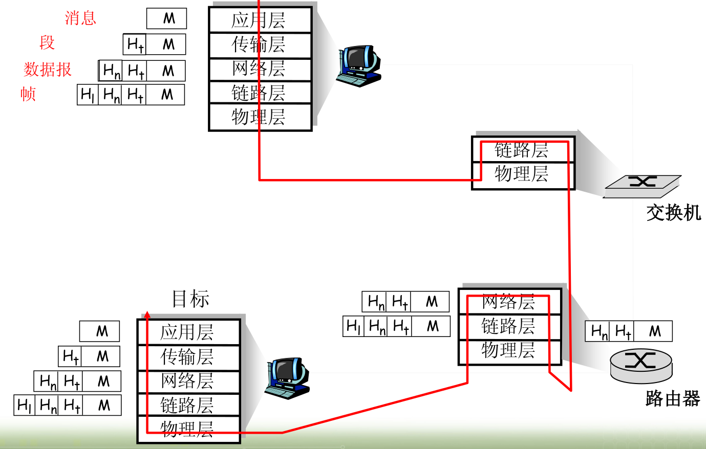
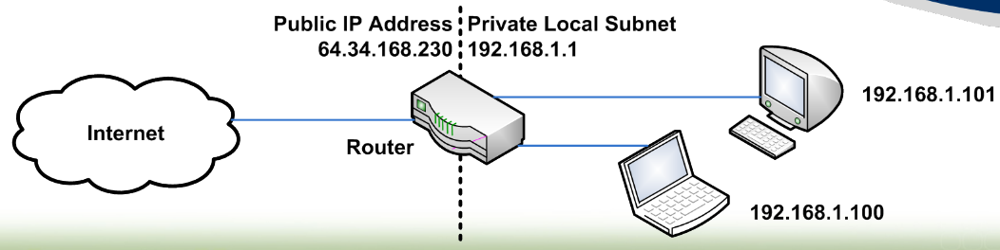
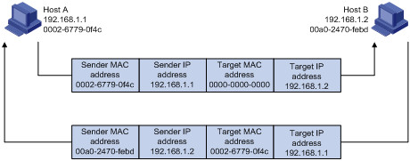
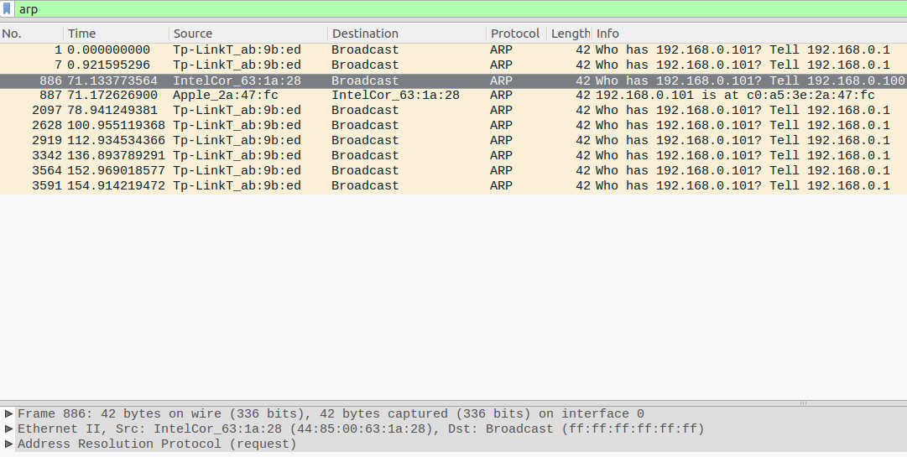
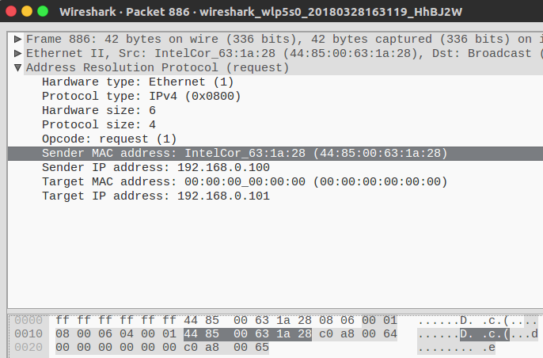
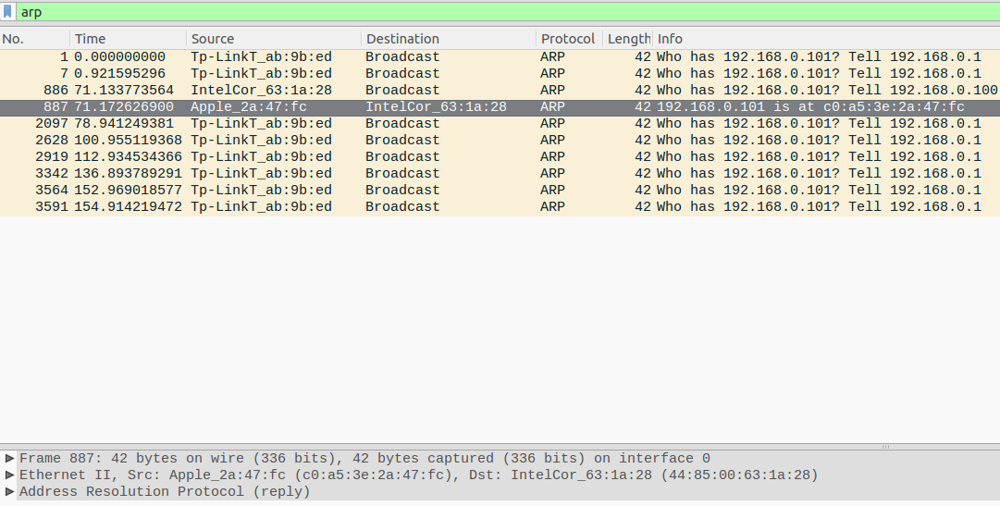
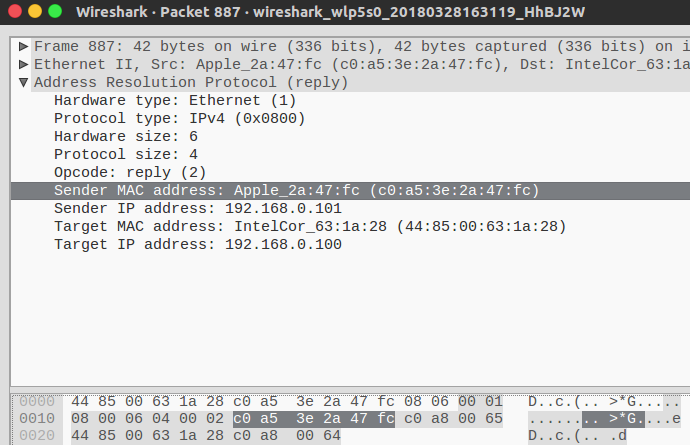

# TCP/IP

常用名称：

IEEE: 电气和电子工程师协会( IEEE，全称是Institute of Electrical and Electronics Engineers)是一个国际性的电子技术与信息科学[工程师](https://baike.baidu.com/item/%E5%B7%A5%E7%A8%8B%E5%B8%88)的协会

IEEE 802.3: 以太网协议标准

IEEE 802.3ba: IEEE标准组织关于40Gb/s和100Gb/s以太网的专门研究组，为40Gb/s和100Gb/s的以太网制定物理接口规范

IEEE 802.11：**无线局域网（WLAN）** 

IEEE 802.11a：1999年，WLAN物理层补充（54Mbit/s，播在5GHz）

IEEE 802.11b：1999年，WLAN物理层补充（11Mbit/s播在2.4GHz）

IEEE 802.11g：2003年，WLAN物理层补充（54Mbit/s，播在2.4GHz）

IEEE 802.11n：WLAN更高传输速率的改善，基础速率提升到72.2Mbit/s，可以使用双倍带宽40MHz，此时速率提升到150Mbit/s。支持多输入多输出技术（Multi-Input Multi-Output，MIMO）

IEEE 802.11ac：802.11n的潜在继承者,更高传输速率的改善，当使用多基站时将无线速率提高到至少1Gbps，将单信道速率提高到至少500Mbps。使用更高的无线带宽(80MHz-160MHz)(802.11n只有40MHz)

IEEE 802.15：无线个人网（Wireless Personal Area Networks，WPAN）

IEEE 802.15.4：低速无线个人网络，如**ZigBee**


## 1. 协议栈

以太网理论上是七层协议，但是实际使用都是五层协议：

| OSI七层网络模型 | TCP/IP四层网络模型 | 对应网络协议                           | 单位        |
| --------------- | ------------------ | -------------------------------------- | ----------- |
| 应用层          | 应用层             | TFTP，FTP，NFS，WAIS                   | 消息        |
| 表示层          |                    | Telnet，rlogin，SNMP，Gopher           |             |
| 会话层          |                    | SMTP，DNS                              |             |
| 传输层          | 传输层             | TCP，UDP                               | 段          |
| 网络层          | 网际层             | IP，ICMP，ARP，RARP，AKP，UUCP         | 数据报      |
| 数据链路层      | 网络接口层         | FDDI，Ethernet，Arpanet，PDN，SLP，PPP | 帧，类比CAN |
| 物理层          |                    | IEEE 802.x                             | 网线上的位  |


## 2. 数据流




## 3. 地址

### 3.1 MAC地址

与局域网上的硬件相关，只能在局域网使用，不能全局路由。特定于IEEE 802.x的不同协议（以太网，Zigbee，WiFi），也就是说不同世界的不同编号，没有相关性。

格式：IEEE“EUI-48/64”格式

6/8个字节:如00:04:A3:00:12:34

前3个字节为供应商OUI代码

后3/5个字节在生产中序列化


### 3.2 IPv4地址

网络地址，可全球路由，IPv4地址分为A,B,C,D,E类:

- **A类:** 1.0.0.0~126.255.255.255,默认子网掩码/8,即255.0.0.0 (其中127.0.0.0~127.255.255.255为环回地址,用于本地环回测试等用途)，网段占据前8个bit，最后24bit是主机号；


- **B类:** 128.0.0.0~191.255.255.255,默认子网掩码/16,即255.255.0.0，网段占据前16个bit，最后1bit才是主机号；


- **C类:** 192.0.0.0~223.255.255.255,默认子网掩码/24,即255.255.255.0，网段占据前24个bit，最后8bit是主机号；


- **D类:** 224.0.0.0~239.255.255.255,一般于用组播


- **E类:** 240.0.0.0~255.255.255.255(其中255.255.255.255为全网广播地址),E类地址一般用于研究用途..


**PS:** IPv4中还有一种私有地址,即比如**内部局域网**所用的地址,分别为:

10.0.0.0~10.255.255.255；
172.16.0.0~172.31.0.0；
192.168.0.0~192.168.255.255


### 3.3 端口号

16位无符号整数(1至65535,0是保留的端口号)，一些应用已标准化端口号，如HTTP固定是80端口。

用邮件打比方: IP地址是建筑物的街道地址，端口号是房间


## 4. NAT

NAT（Network Address Translation，网络地址转换）是1994年提出的。当在专用网内部的一些主机本来已经分配到了本地IP地址（即仅在本专用网内使用的专用地址），但现在又想和因特网上的主机通信（并不需要加密）时，可使用NAT方法。

这种方法需要在专用网连接到因特网的路由器上安装NAT软件。装有NAT软件的路由器叫做NAT路由器，它至少有一个有效的外部全球IP地址。这样，所有使用本地地址的主机在和外界通信时，都要在NAT路由器上将其本地地址转换成全球IP地址，才能和因特网连接。

另外，这种通过使用少量的公有IP 地址代表较多的私有IP 地址的方式，将有助于减缓可用的IP地址空间的枯竭。




## 5. DNS

DNS 是域名系统 (Domain Name System) 的缩写，是因特网的一项核心服务，它作为可以将域名和IP地址相互映射的一个分布式数据库，能够使人更方便的访问互联网，而不用去记住能够被机器直接读取的IP数串。

在互联网中，其实没有类似于[www.xxx.com](http://www.xxx.com/)这种域名方式，而替代的是以IP地址，如222.222.222.222，那我们在IE地址栏中应当输入222.222.222.222才能打开网站www.xxx.com，但我们细想一下，互联网上的网站成千上万，如果每个网站登陆都需要记住一大串数字，那是不是特别不方便，对于记忆力不强的人，根本无法记住这么烦琐的数字。这个时候DNS就出现了，它的作用就是将222.222.222.222解析为www.xxx.com，那么我们登陆的时候就直接输入域名就可以了。

为什么一定要设置DNS才能上网？有些朋友可能会发现，为什么我可能登陆QQ、MSN，但却打不开网页呢？其实大部分原因都是因为DNS服务器故障造成的，DNS服务器地址是唯一的，是运营商提供给终端用户用来解析IP地址及域名的关系，而如果不设定DNS服务器地址，那么就无法查询地址的去向，自然也就打不开网页，而QQ、MSN等即时聊天软件，采用的是UDP传输协议，即不可靠传输协议，无需提供DNS服务器地址，也同样可以登陆。

DNS查询过程：


在浏览器中输入www.qq.com域名

​                             |

 检查自己本地的hosts文件是否有这个网址映射关系

​                             |没有

查找本地DNS解析器缓存

​                            |没有

查找TCP/ip参数中设置的首选DNS服务器，即本地DNS服务器

​                            |没有

根据本地DNS服务器的设置（是否设置转发器）进行查询，如果未用转发模式，本地DNS就把请求发至13台根DNS，根DNS服务器收到请求后会判断这个域名(.com)是谁来授权管理，并会返回一个负责该顶级域名服务器的一个IP。

​                            |

本地DNS服务器收到IP信息后，将会联系负责.com域的这台服务器。这台负责.com域的服务器收到请求后，如果自己无法解析，它就会找一个管理.com域的下一级DNS服务器地址(qq.com)给本地DNS服务器。当本地DNS服务器收到这个地址后，就会找qq.com域服务器，重复上面的动作，进行查询，直至找到www.qq.com主机。

​                            |

如果用的是转发模式，此DNS服务器就会把请求转发至上一级DNS服务器，由上一级服务器进行解析，上一级服务器如果不能解析，或找根DNS或把转请求转至上上级，以此循环。不管是本地DNS服务器用是是转发，还是根提示，最后都是把结果返回给本地DNS服务器，由此DNS服务器再返回给客户机


举例：

我的电脑设置的首选DNS服务器就是网关：192.168.50.1，当浏览器上百度的时候，用wireshark抓包可看到查询过程：


## 5. ARP

### 5.1 作用

ARP（Address Resolution Protocol，地址解析协议）是将IP地址解析为以太网MAC地址（或称物理地址）的协议。在局域网中，当主机或其它网络设备有数据要发送给另一个主机或设备时，它**必须知道对方的网络层地址（即IP地址）**。但是仅仅有IP地址是不够的，因为IP数据报文必须封装成帧才能通过物理网络发送，因此发送站还**必须有接收站的MAC地址**，所以需要一个从IP地址到MAC地址的映射。APR就是实现这个功能的协议。


###5.2 解析过程 

假设主机A和B在同一个网段，主机A要向主机B发送信息。如图，具体的地址解析过程如下：


(1) 主机A首先查看自己的ARP表，确定其中是否包含有主机B对应的ARP表项。如果找到了对应的MAC地址，则主机A直接利用ARP表中的MAC地址，对IP数据包进行帧封装，并将数据包发送给主机B。

(2) 如果主机A在ARP表中找不到对应的MAC地址，则将缓存该数据报文，然后以广播方式发送一个ARP请求报文。ARP请求报文中的发送端IP地址和发送端MAC地址为主机A的IP地址和MAC地址，目标IP地址和目标MAC地址为主机B的IP地址和全0的MAC地址。由于ARP请求报文以广播方式发送，该网段上的所有主机都可以接收到该请求，但只有被请求的主机（即主机B）会对该请求进行处理。

(3) 主机B比较自己的IP地址和ARP请求报文中的目标IP地址，当两者相同时进行如下处理：将ARP请求报文中的发送端（即主机A）的IP地址和MAC地址存入自己的ARP表中。之后以单播方式发送ARP响应报文给主机A，其中包含了自己的MAC地址。

(4) 主机A收到ARP响应报文后，将主机B的MAC地址加入到自己的ARP表中以用于后续报文的转发，同时将IP数据包进行封装后发送出去。


举例：

自己的电脑ip：

```
wlp5s0    Link encap:Ethernet  HWaddr 44:85:00:63:1a:28  
          inet addr:192.168.0.100  Bcast:192.168.0.255  Mask:255.255.255.0
          inet6 addr: fe80::1902:ec3:bc0e:f387/64 Scope:Link
          UP BROADCAST RUNNING MULTICAST  MTU:1500  Metric:1
          RX packets:281418 errors:0 dropped:0 overruns:0 frame:0
          TX packets:147025 errors:0 dropped:0 overruns:0 carrier:0
          collisions:0 txqueuelen:1000 
          RX bytes:254235462 (254.2 MB)  TX bytes:24746806 (24.7 MB)
```

ping局域网内的101，用wireshark抓包：

```
robin@robin-pc:~$ ping 192.168.0.101
PING 192.168.0.101 (192.168.0.101) 56(84) bytes of data.
64 bytes from 192.168.0.101: icmp_seq=1 ttl=64 time=43.7 ms
64 bytes from 192.168.0.101: icmp_seq=2 ttl=64 time=258 ms
64 bytes from 192.168.0.101: icmp_seq=3 ttl=64 time=80.6 ms
^C
--- 192.168.0.101 ping statistics ---
3 packets transmitted, 3 received, 0% packet loss, time 2003ms
rtt min/avg/max/mdev = 43.717/127.571/258.370/93.708 ms
```

可以看到本机发出的广播包：



可以看到frame包含了本机的ip，mac地址：



下一条就是101的回复（101是手机，还有apple的前缀）



回复中包含了101的mac地址：




###5.3 ARP表

上个例子中，当本机获得IP地址以后，就会在自己的arp表中增加手机的ip和mac的映射表：

ARP表项分为动态ARP表项和静态ARP表项。

#### 5.3.1 动态ARP表

动态ARP表项由ARP协议通过ARP报文自动生成和维护，可以被老化，可以被新的ARP报文更新，可以被静态ARP表项覆盖。当到达老化时间、接口down时会删除相应的动态ARP表项。

####5.3.2 静态ARP表项 

静态ARP表项通过手工配置和维护，不会被老化，不会被动态ARP表项覆盖。

配置静态ARP表项可以增加通信的安全性。静态ARP表项可以限制和指定IP地址的设备通信时只使用指定的MAC地址，此时**攻击报文无法修改**此表项的IP地址和MAC地址的映射关系，从而保护了本设备和指定设备间的正常通信。

静态ARP表项分为短静态ARP表项和长静态ARP表项。

- 在配置长静态ARP表项时，除了配置IP地址和MAC地址项外，还必须配置该ARP表项所在VLAN和出接口。长静态ARP表项可以**直接用于报文转发**。


- 在配置短静态ARP表项时，只需要配置IP地址和MAC地址项。如果出接口是三层以太网接口，短静态ARP表项可以直接用于报文转发；如果出接口是VLAN虚接口，短静态ARP表项**不能直接用于报文转发**，当要发送IP数据包时，**先发送ARP请求报文**，如果收到的响应报文中的源IP地址和源MAC地址与所配置的IP地址和MAC地址**相同**，则将接收ARP响应报文的接口加入该静态ARP表项中，之后就可以用于IP数据包的转发。

其余arp类型参考：http://blog.163.com/hlz_2599/blog/static/142378474201341395651453/


